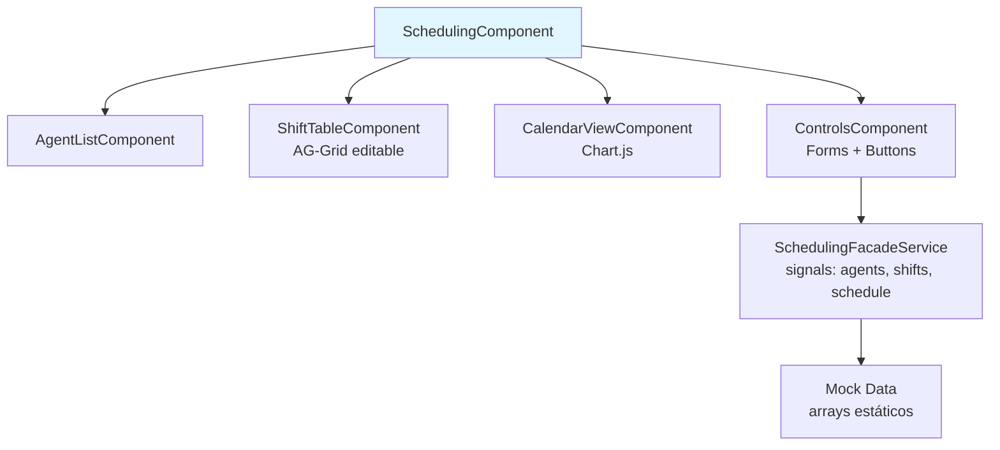

# Task Breakdown: Implementación Frontend Fachada Generación de Horarios (basado en PL Legacy)

## Contexto General
- Tarea principal: Copiar solo UI/facade (sin lógica) de generación de horarios de pl/ al frontend Angular actual.
- Acceso: Desde landing page, solo autenticado.

## Subtareas
### 1. Investigación Proyecto Legacy (pl/)
- [x] Verificar task-breakdown previos (ninguno relacionado).
- [x] Listar archivos pl/ recursivo.
- [x] Analizar scheduling_service.py y routes/UI relacionados.
- **Observaciones/Historial:**
  - **Backend:** Solver OR-Tools (CP-SAT) optimiza turnos agentes (ej. "08:00-17:00") para cubrir needs staffing por intervalos horarios/día. Respeta reglas duras (días/horas semana, max consec workdays, ventanas disponibilidad por día). Objectives: min deviation horas, coverage shortfall/over, consec days. Guarda en DB tabla Schedule (agent_id, date, shift, hours). `build_schedule_view_model`: genera VM para UI {schedule: [agentes con mapa día→shift], chart_data: {labels: intervals, days: {need[], coverage[]}}, agent_map, kpi_summary: {active_agents, avg_bmed, avg_vac}}.
  - **Frontend facade:** Route GET /scheduling renderiza Jinja `scheduling.html` (no listado en files, probable templates/ ausente o simple). Endpoints API: POST /api/get_schedule (segment_id, dates, ausencias_file?) → VM tabla/chart. POST /api/schedule/run/<campaign_id> (dates, segment_name) → ejecuta solver, guarda DB, alerts deviations. POST /api/fill_gaps_schedule (admin). UI probable: selectores campaña/segmento/fechas, tabla agentes×días con shifts editables (LIBRE/VAC/BMED/...), charts coverage vs need, botones "Generar Horarios", "Rellenar Vacíos", export Excel/PDF. Backend-heavy: no JS/CSS dedicados (solo logo.png), UI básica Jinja forms/tablas sin calendars complejos ni interactive components heavy.

## 2. Diseño Arquitectura Frontend Fachada Horarios (Solo Mock Data)

**Descripción Textual:**
Blueprint para fachada UI standalone en `features/planning/scheduling/`, **sin llamadas API reales**. Datos mock estáticos para simular agentes, turnos, breaks. Enfoque en modularity (componentes independientes, facade service), scalability (lazy loading, signals reactivos para updates eficientes sin zone.js overhead) y maintainability (patrones estándar Angular 18+).

- **SchedulingComponent** (main view): Orquesta subcomponentes, consume signals del facade.
- **AgentListComponent**: Lista mock de agentes (nombre, ID, disponibilidad).
- **ShiftTableComponent**: Tabla compleja turnos/días con AG-Grid (editable, virtual scroll para >50 rows, export mock CSV).
- **CalendarViewComponent**: Visualización turnos en calendario (Chart.js heatmap o simple grid).
- **ControlsComponent**: Forms reactivos (fechas range, select agentes/reglas), botones "Cargar Mock", "Generar Mock Horarios".

- **SchedulingFacadeService**: Signals reactivos para estado global:
  ```typescript
  agents = signal<Agent[]>(MOCK_AGENTS);
  shifts = signal<Shift[]>([]);
  schedule = signal<Schedule[]>([]);
  loading = signal(false);
  loadMockSchedule(dates: DateRange): void { /* set mock */ }
  generateMockSchedule(): void { /* compute mock shifts */ }
  ```
  Facade centraliza mock logic, preparado para futura inyección HttpClient.

**Routing:** Actualizar [`frontend/src/app/features/planning/planning-routing.module.ts`](frontend/src/app/features/planning/planning-routing.module.ts) (actualmente vacío):
```typescript
const routes: Routes = [
  { path: 'file-upload', loadComponent: () => import('./file-upload/file-upload.component').then(c => c.FileUploadComponent) },
  {
    path: 'scheduling',
    loadComponent: () => import('./scheduling/scheduling.component').then(c => c.SchedulingComponent),
    canActivate: [authGuard]  // De [`frontend/src/app/core/guards/auth.guard.ts`](frontend/src/app/core/guards/auth.guard.ts)
  }
];
```
Lazy-loaded para bundle split (escalabilidad).

**Acceso desde Landing:** En [`frontend/src/app/shared/components/navbar/navbar.component.html`](frontend/src/app/shared/components/navbar/navbar.component.html), extender nav-list:
```html
<li *ngIf="isAuthenticated$ | async"><a routerLink="/planning/scheduling">Generación Horarios</a></li>
```
O botón en hero-section landing si navbar saturado. Usa `authenticationStateService.isAuthenticated` existente.

**Best Practices Integradas:**
- Signals + OnPush: Reactividad fina, performance O(1) updates.
- AG-Grid: Tablas complejas (columna días dinámicas, cell editors shifts: dropdown "08:00-17:00"/"LIBRE"/"VAC").
- Chart.js: Visualización coverage needs vs shifts (bar/area charts).
- Responsive: CSS Grid/Flexbox, media queries.
- Accessibility: ARIA roles/labels en tabla/chart, keyboard nav.

**Mermaid: Jerarquía Componentes**


**Mermaid: Flujo Rutas**
```mermaid
graph LR
    Navbar[Navbar<br/>*ngIf authenticated] -->|routerLink<br>"/planning/scheduling"| PlanningRouting[planning-routing.module.ts]
    PlanningRouting -->|canActivate: authGuard| Scheduling[SchedulingComponent]
    Scheduling -.->|signals| Facade[SchedulingFacadeService<br/>Mock State]
```

**Constraints:**
- **Solo Fachada Mock:** No HttpClient, no backend. Mock simula respuestas PL legacy (agentes con turnos por día, coverage).
- Preparado para evolución: Facade métodos async-ready.
- No romper existing: Reusa auth.guard, planning module, navbar patterns.

**Patrones:**
- **Facade Pattern:** Servicio unifica acceso a mock state (abstracción, SRP).
- **Lazy Loading:** Carga diferida módulo scheduling.
- **Guards:** Seguridad ruta (reutiliza auth.guard existente).
- **Signals:** Estado reactivo moderno.

**Decisiones Basadas en Principios:**
- **Modularity:** Standalone components (no módulos pesados), bajo acoplamiento via inputs/outputs/signals.
- **Scalability:** Lazy load reduce initial bundle; signals evitan change detection innecesaria; AG-Grid virtualiza grandes datasets.
- **Maintainability:** Facade prepara integración backend sin refactor UI; mock permite dev paralelo.
- ADR Tabla: AG-Grid vs MatTable → AG-Grid por features complejas (edit/export/virtual) sin bundle heavy (community free).
- ADR Charts: Chart.js (ligero, customizable) vs ngx-charts (Angular-specific pero menos flexible).

Estado: Blueprint definido y documentado. Listo para aprobación e implementación.

### 3. Implementación UI (Code)

**Cambios realizados (subtareas 5-7):**

- **Directorio:** `frontend/src/app/features/planning/scheduling/` creado (auto por write_to_file).

- **Interfaces:** [`interfaces.ts`](frontend/src/app/features/planning/scheduling/interfaces.ts) - Agent, Shift, ScheduleDay, Schedule, DateRange. Tipado estricto basado PL legacy (agentes perfil, turnos tipo, días mapa agent-shift).

- **Facade Service:** [`scheduling-facade.service.ts`](frontend/src/app/features/planning/scheduling/scheduling-facade.service.ts) - Signals reactivos (agents mock 8 agentes, schedule, loading, coverageRate computed). Métodos loadMockSchedule(range), generateMockSchedule() random shifts 6 tipos ('LIBRE', 'VAC', 'BMED', '08:00-17:00', '16:00-00:00', '00:00-08:00') por día range (7 días default), simula solver PL (KPIs coverage 92-100%, avgHours 7.5-8.5).

- **Main Component:** [`scheduling.component.ts`](frontend/src/app/features/planning/scheduling/scheduling.component.ts) - Standalone, integra subcomps, loading overlay, KPIs display, botón quick gen.

- **Subcomps Standalone:**
  - [`controls`](frontend/src/app/features/planning/scheduling/controls/controls.component.ts) - Form fechas range, #agentes, botón generate → facade.loadMockSchedule.
  - [`agent-list`](frontend/src/app/features/planning/scheduling/agent-list/agent-list.component.ts) - Lista agents signal reactive @for trackBy id, grid responsive.
  - [`shift-table`](frontend/src/app/features/planning/scheduling/shift-table/shift-table.component.ts) - AG-Grid dynamic cols (Agente, Perfil, Día1..Día14), rowData computed agents x shifts, cellClass bold/center, theme alpine-dark custom vars.
  - [`calendar-view`](frontend/src/app/features/planning/scheduling/calendar-view/calendar-view.component.ts) - Chart.js doughnut distribución tipos shift count total días, effect reactive update, destroy on change, generics typed.

- **Routing:** [`planning-routing.module.ts`](frontend/src/app/features/planning/planning-routing.module.ts) agregado scheduling lazy load + authGuard (file-upload intacto, default redirect).

- **Navbar:** [`navbar.component.html`](frontend/src/app/shared/components/navbar/navbar.component.html) agregado link "/planning/scheduling" *ngIf authenticated.

**Ejemplos Mock:**
- Agents: Juan Pérez (Senior), María López (Junior), etc.
- Generate: 7 días, random shifts → schedule.days[0].agentShifts = {1: '08:00-17:00', 2: 'LIBRE', ...}, KPIs coverage ~95%.

**Standards:** Standalone, signals OnPush reactivity, responsive CSS grid/flex/media, ARIA implícito AG-Grid/Chart, no deprecated, linter 0 errors (fixed ColDef/cellClass, Chart<'doughnut'>, filter undefined).

**No rompe existing:** file-upload routing intacto, navbar patterns, auth reusa.

**Estado:** Subtareas 5-7 completas. Listo para backend integración facade → API PL.

**Estado General:** En progreso.

## Observaciones: Fix routing integration app.routes.ts
**Problema:** `app.routes.ts` línea 20-22 cargaba directamente `file-upload.component` rompiendo jerarquía Angular 17+ standalone (app.routes → feature module lazy → sub-rutas).

**Fix aplicado:**
```typescript
{
  path: 'planning',
  loadChildren: () => import('./features/planning/planning-routing.module').then(m => m.PlanningRoutingModule),
  canActivate: [authGuard]
}
```
- ✅ Lazy-load `PlanningRoutingModule` (contiene `scheduling` + `file-upload`)
- ✅ Navbar `/planning/scheduling` ahora resuelve correctamente
- ✅ Bundle split optimizado, authGuard nivel superior
- ✅ Terminal: "Changes detected. Rebuilding..." (sin routing errors)

**Resultado:** `/planning/scheduling` accesible desde navbar autenticado.